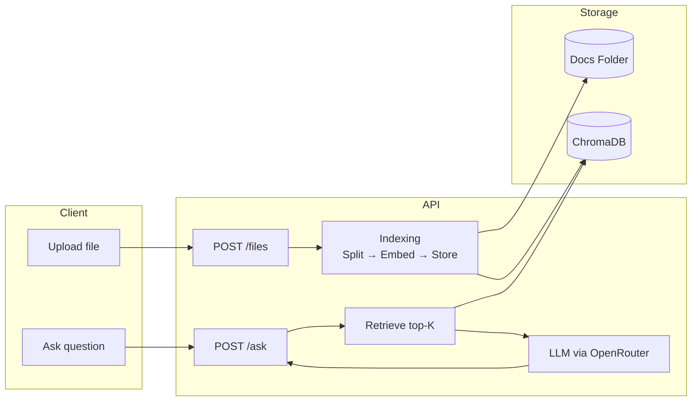

# RAG Chatbot API

[](#)
[](#)
[](#)
[](#)
[](#)

A production-ready FastAPI service for Retrieval-Augmented Generation (RAG). Upload documents, embed them locally using ChromaDB, and ask grounded questions backed strictly by your indexed knowledge base.

---

## Table of Contents

* [Architecture](#architecture)
* [Getting Started](#getting-started)
* [Environment Setup](#environment-setup)
* [Usage Examples](#usage-examples)
* [API Endpoints](#api-endpoints)
* [Technologies](#technologies)
* [Testing](#testing)
* [Project Structure](#project-structure)
* [License](#license)

---

## Architecture



---

## Getting Started

### Requirements

* Python **3.10+**
* `pip` and `virtualenv`
* OpenRouter API key

### Installation

```bash
git clone https://github.com/inclyner/simple-doc-based-rag.git
cd simple-doc-based-rag
python -m venv .venv
# Windows
.\.venv\Scripts\activate
# macOS/Linux
# source .venv/bin/activate
pip install -r requirements.txt --progress-bar=on
```

---

## Environment Setup

Create an `.env` file at **app/.env** (or export environment variables system-wide):

```
OPENROUTER_API_KEY=your_openrouter_key_here
OPENROUTER_BASE_URL=https://openrouter.ai/api/v1
OPENROUTER_MODEL=tngtech/deepseek-r1t2-chimera:free
```

You can get a **free API key** from OpenRouter by logging in with **Hugging Face or Google**:
[https://openrouter.ai/keys](https://openrouter.ai/keys)

The default model used in this project is **DeepSeek R1T2 Chimera Free**, which has **0 cost** and is suitable for development.

Optional configuration (defaults in `app/config.py`):

```
CHROMA_DIR=app/data/chroma
DATA_DIR=app/data/docs
RETRIEVAL_K=4
ALLOWED_EXTS=.txt,.md,.pdf
MAX_UPLOAD_MB=25
```

---

## Run
⚠️ **Note:** On first run, the embedding model (`intfloat/e5-base-v2`) will be downloaded automatically.
> This is a one-time download of about **500MB**, so the first startup may take longer.
```bash
uvicorn app.main:app --reload --host 0.0.0.0 --port 8000
```

* Docs UI: [http://localhost:8000/docs](http://localhost:8000/docs)
* Health check: [http://localhost:8000/health](http://localhost:8000/health)

---

## Usage Examples

The easiest and recommended way to interact with the API during development is through the interactive documentation at http://localhost:8000/docs. It provides a UI where you can upload files and ask questions without needing curl or Postman.

Below are equivalent command-line examples:

### Upload a file
> Accepted file types are `.txt`, `.md`, and `.pdf`.
> Two test documents are available on tests/test_docs
```bash
curl -X POST "http://localhost:8000/files/" \
  -F "file=@example.txt"
```

### Ask a question

```bash
curl -X POST "http://localhost:8000/ask/" \
  -H "Content-Type: application/json" \
  -d '{"question": "What is mentioned about the solar system?"}'
```

### Delete a document

```bash
curl -X DELETE "http://localhost:8000/files/<doc_id>"
```

---

## API Endpoints
| Method | Endpoint                     | Description                         |
| ------ | ---------------------------- | ----------------------------------- |
| POST   | `/files`                     | Upload and embed a document         |
| DELETE | `/files/{doc_id}`            | Remove document + vectors           |
| POST   | `/ask`                       | Ask a question using RAG            |
| GET    | `/health`                    | Health check                        |
| GET    | `/files/debug/chroma`        | Chroma debug: count + sample        |
| DELETE | `/files/debug/reset_docs`    | Reset vectors (clear collection)    |

---

## Technologies

* **FastAPI** – API layer
* **ChromaDB** – local vector search
* **E5 Embeddings** (`intfloat/e5-base-v2`) – semantic search
* **OpenRouter** – LLM requests
* **LangChain** – text splitting utilities
* **pytest** – automated testing

---

## Testing

Run:
> The implemented tests take about 1 minute to run.
```bash
pytest -q
```

Test coverage includes:

* File ingestion and metadata
* Vector deletion consistency
* Contradiction test (context overrides model)
* Synonym semantic retrieval
* Missing context strict fallback
* Deleted doc isolation behavior

---

## Project Structure

```
app/
  main.py                # FastAPI app and router setup
  config.py              # Settings and environment loader
  models.py              # Request/response schemas
  routes/
    ask.py               # /ask question endpoint
    files.py             # /files upload/delete endpoints
  services/
    indexer.py           # File ingestion, embedding and vector DB
  data/
    docs/                # Uploaded source files
    chroma/              # Chroma persistence
```

---

## License

MIT License

---

Built by **Francisco Andrade Carvalho** ✅
